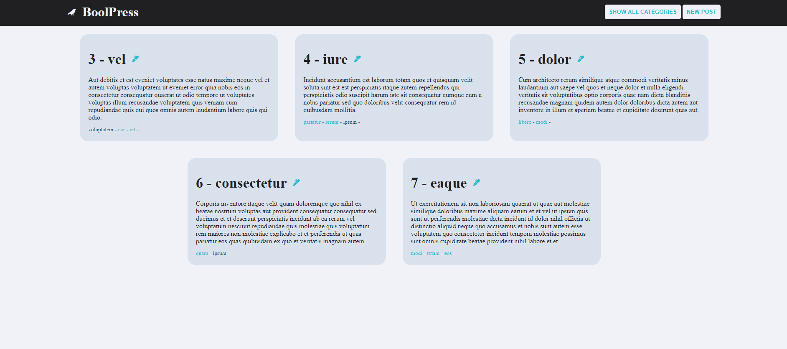
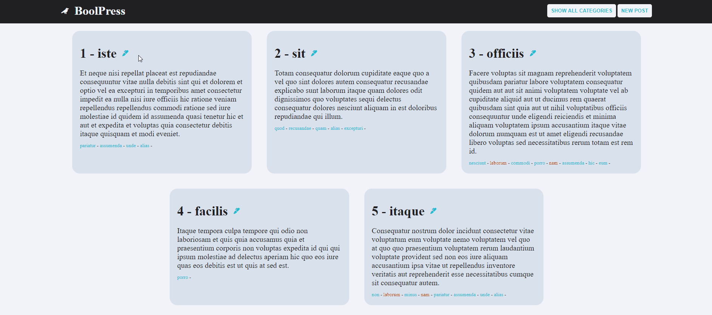

## Laravel BoolPress

This project was designed using <b>seeders, factories, migrations, models, controllers, tables and databases</b>.

For this blog it was necessary to create a database containing posts (with id, title and content) and categories (with id and name).

The two tables have been linked with a relation n:m.

In this case a test database was created by inserting fake data into the tables.

Only the last 5 posts created are shown on the homepage.

 

## Create new posts

Clicking on the New Post button, you have the possibility to insert a new post in the database.
You can then enter a title, the content and assign categories.

  

## Edit posts

By clicking on the pen it is also possible to modify a post by changing the title, content or categories.

  

